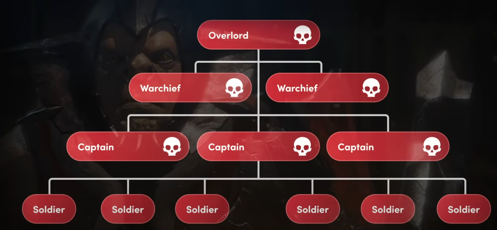

- Enemies and entities should react to stimulus instead of specific events. [{{video https://youtu.be/SnpAAX9CkIc?si=kfrU1zWJrXrY1Cr-&t=370}}]
	- {{video https://youtu.be/Gelpn4mksXQ?si=iZ7F0UjRvHzGbbeW&t=248}}
	-
	-
	- Ex: Entities have a temperature, when a fire nearby it increases and when it hits a certain temperature it catches fire that also increase temperature further.
	- Ex: Enemy being on alert when hears a sound nearby, or an animal gets scared and runs from fire
-
- Need to find a proper way to document interactions(Maybe a graph view?)
-
- Enemies also take part in automatic missions and develop themselves with time and somewhat stay balanced considering the player
	- 
	- https://www.youtube.com/watch?v=Lm_AzK27mZY
