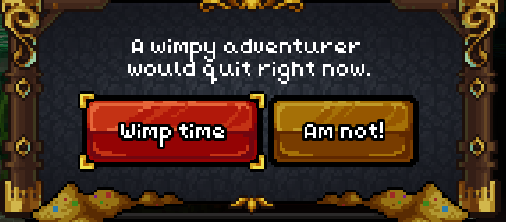

- Instead of having tutorial menu, tutorial text is prompted by either a magic letter on player inventory or a crow delivery (Like Demon slayer).
-
- All mechanics should be easily explained in-game, with the possibility of opening a more in-depth wiki without opening a browser.
-
- Early game:
	- First 5 minutes the player has very little stamina and can barely run, but it quickly increases stamina and running skills.
	- First jump the player will fall, then get enough experience in jumping so they can jump normally
	-
	- When low mana, it's hard to breath and screen goes gray, as if it drains your life
-
	- You need to maintain your weapons by doing blacksmith job, or they will break and disappear.
-
-
- Every time you press to quit it gives you an offensive different quote
	- 
-
-
-
- After game release if no other priority:
	- Chess
	- Musical instruments
		- Acoustic guitar
		- Drum
	- Television with in game news events from nation
