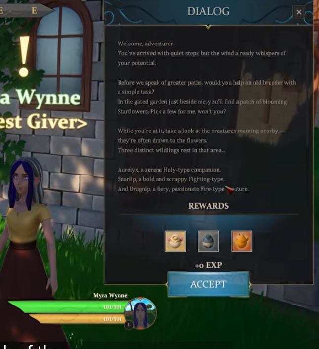

- When nearby a NPC that have a new quest, they will keep saying: (What variation depends on personality traits that are randomly generated)
  collapsed:: true
	- "I need your aid!"
	- "Please help me!"
	- "Can you do this mission?"
	- "Are you strong enough to help me kiddo?"
- If you approach (Cone 'raycast' check)
  collapsed:: true
	- Opens minimal popup on left side, "Want to check this quest?"
- When agree to check the quest:
  collapsed:: true
	- 
	- In a letter like paper, present the exact text that the NPC will say, with an accept or refuse.
- When refusing:
  collapsed:: true
	- Lose general reputation and with this NPC, and with this town
-
- Quests possibilities (Tier based [F-S]):
  collapsed:: true
	- [F-D]: Fetch at least [x] of these [herbs] on this [location]. (Each herb increases payout and reputation gain in case player grabs more than needed)
	- [D+ to S]: The [specific animal] population nearby has been increasing a lot lately and is getting out of control, go decrease their number.
	- [C to S]: The [specific animal] population nearby has been decreasing a lot lately and may go extinct, go kill their predators.
	- [C- to S]: A fire has started in a nearby forest, go extinguish it.
-
- Random thunderstorm that may hit a tree and start a generalized fire that triggers a mission to extinguish the fire.
