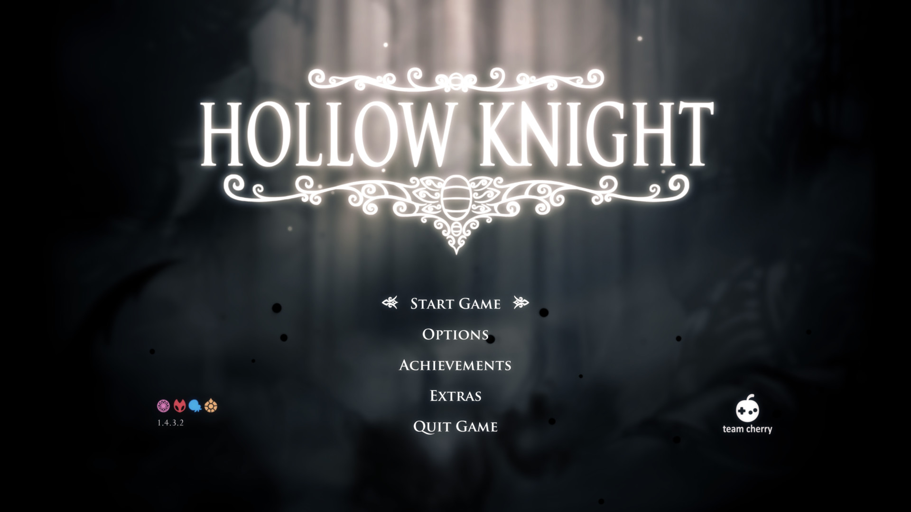
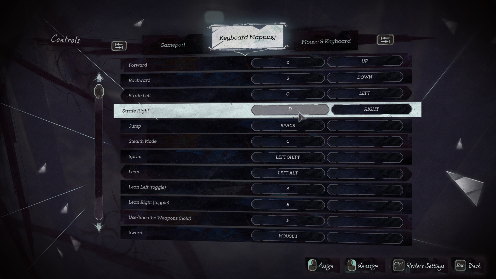
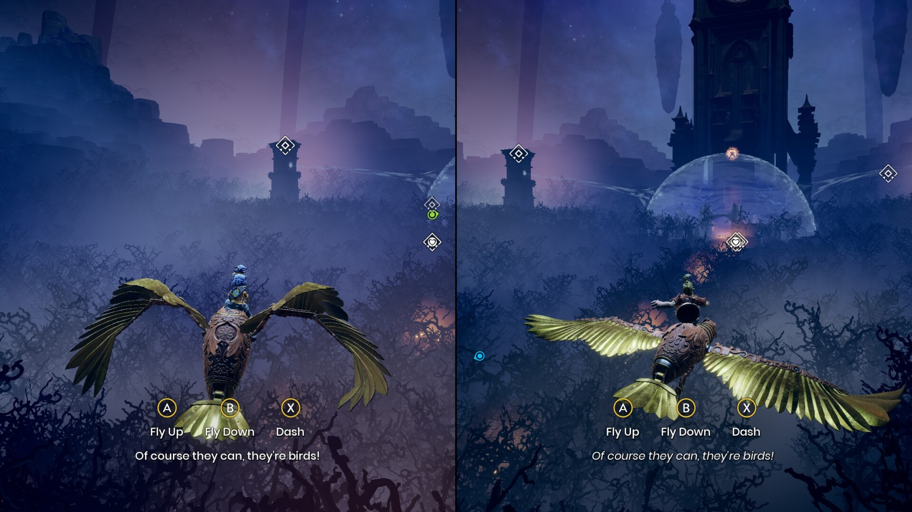
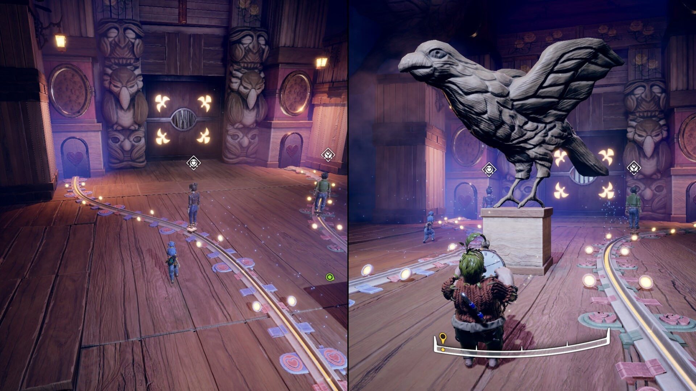
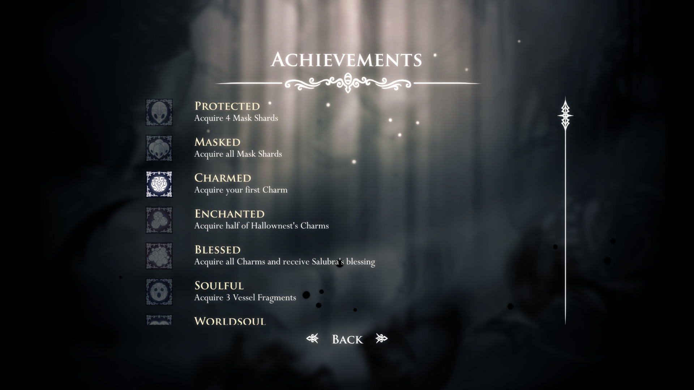

# GUI & Visuals
- The UI should be clear, modern, highlight the message you want to communicate.

- [Interface ingame](https://interfaceingame.com/) and [Game UI Database](https://www.gameuidatabase.com/index.php?set=0&sort=1) have a lot of great examples.

### UI
#### Main Menu:
- Stylized, faded background image giving focus to game's name and options, optionally with an art that participates in the menu.

#### Settings
- Current tab/submenu and focused setting must be extremely clear.

#### New area / Level
- Fade effect (tween), big title text, highlight name with a secondary smaller subtitle with description (difficulty, details, level number)

#### Tutorial
- Prefer in game overlays instead of popups or specific screens. Aim to 'insert' them, make them feel as part of the game to avoid breaking immersion.

#### Achievements
- Can be very simple, either 'enabled' or 'disabled' squared icon with a short description. Bonus for secret achievements.

### Combat:

#### Death:
- Should attract attention, everything at the same time, health bar shatter, disintegrating player animation, hit stop (Global slow motion)

